# Computer-Use CAD Platform

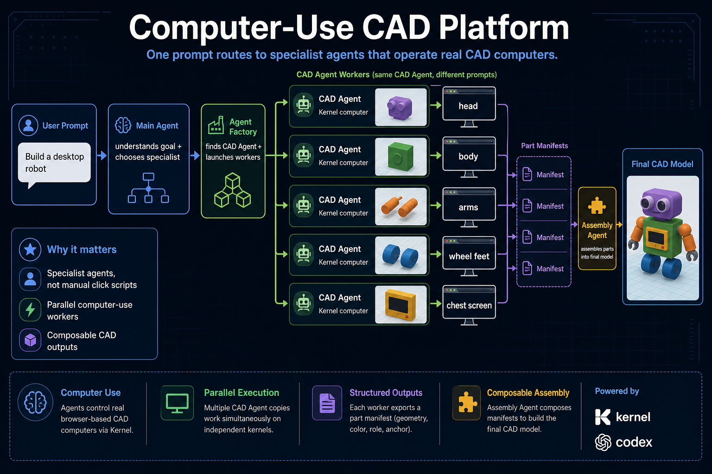

One sentence pitch: **give the main agent a CAD goal, and it finds the right specialist computer-use agent, launches the required Kernel computers, and returns a composed CAD result.**

This repo is a hackathon MVP for an **Agent Factory** pattern. The product idea is not just "make a robot." The product idea is a platform where a main agent can route user intent to specialist agents that operate real computer interfaces.

For this demo, the selected specialist is a **CAD Agent**.

## What We Are Building

Today, computer-use agents are often run as one long UI loop:

```text
user prompt -> one agent -> one browser/computer -> many slow clicks -> result
```

CAD work is different. A design can usually be split into parts. That makes it a good fit for a factory model:

```text
user prompt
  -> Main Agent
  -> Agent Factory
  -> CAD Agent template copied into multiple Kernel computers
  -> exported part manifests
  -> Assembly Agent
  -> final CAD model
```

The user only says what they want. The main agent decides which specialist agent should handle it. In this demo, it picks the CAD Agent, creates several CAD Agent instances, gives each instance a different part prompt, then assembles their outputs.

## Demo Flow

Example prompt:

> Build a polished poster-style toy robot with a purple rounded square head, large silver circular eyes, black eye pupils, a small black smile, a green rounded body, a yellow chest screen frame, a black inner chest display, orange segmented cylinder arms, silver claw hands, blue wheel feet, and dark wheel hubs.

The system does the following:

1. The **Main Agent / Dispatch & Assembly Agent** receives the prompt.
2. The **Agent Factory** selects the CAD Agent specialist for the task.
3. The prompt is decomposed into CAD parts such as `head`, `body`, `arms`, `wheel-feet`, and `chest-screen`.
4. The same **CAD Agent template** is copied into multiple Kernel browser computers.
5. Each CAD Agent instance gets its own part-specific prompt and its own MiniCAD workplane.
6. Each CAD Agent exports a structured part manifest with primitive geometry, color, dimensions, role, and assembly anchor.
7. The Assembly Agent imports those manifests and places the worker outputs into one combined model.
8. The monitor UI streams screenshots, status, live view URLs, action counts, and the final factory manifest.

The important part: the workers are not five different hardcoded agents. They are copies of the same CAD Agent template, each controlled by a different prompt.

## Latest Demo Run

Run captured from the live monitor UI: `monitor-20260509152134`

Task prompt:

> Build a polished poster-style toy robot with a purple rounded square head, large silver circular eyes, black eye pupils, a small black smile, a green rounded body, a yellow chest screen frame, a black inner chest display, orange segmented cylinder arms, silver claw hands, blue wheel feet, and dark wheel hubs.

Final assembly result:

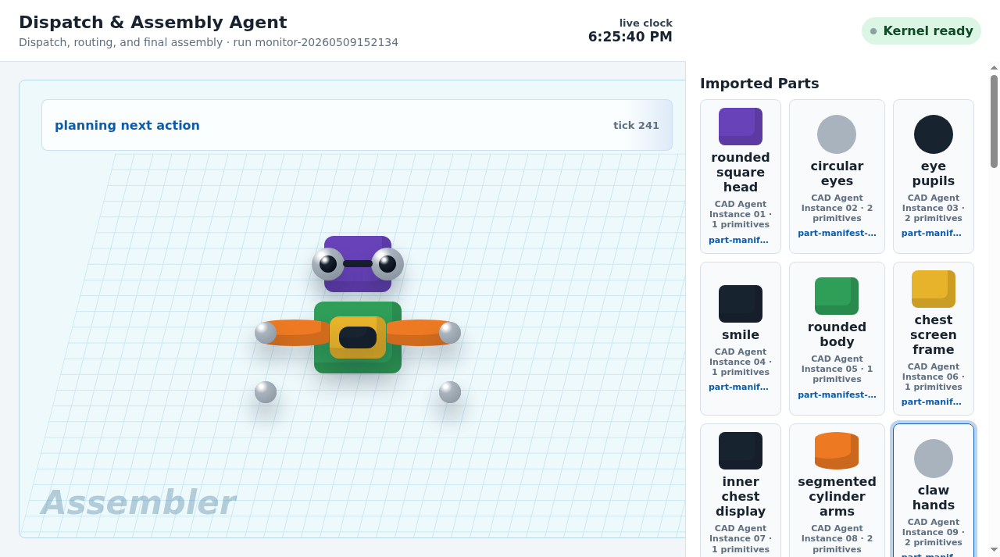

Demo recording / storyboard:

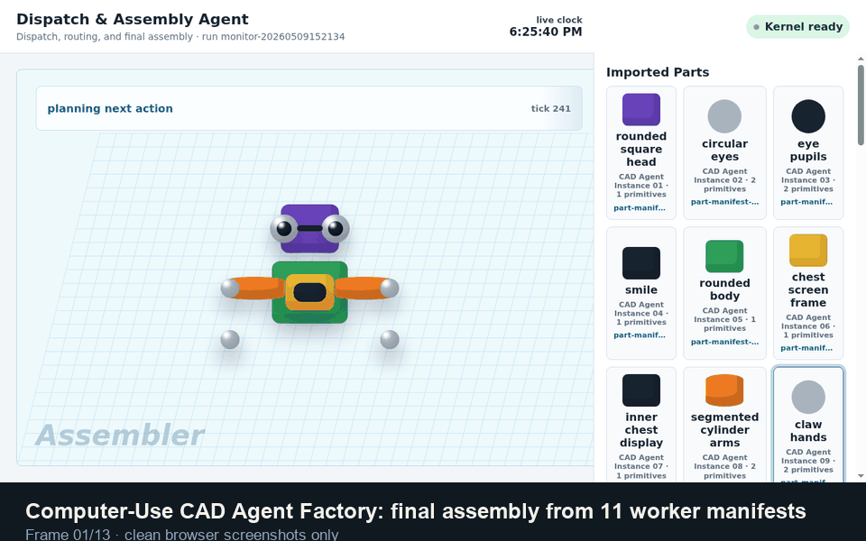

This run created **11 copied CAD Agent instances** from the same CAD Agent template. The Assembly Agent imported **11 part manifests** containing **17 source primitive placements**.

| CAD Agent instance | Part prompt | Output manifest | Screenshot |
| --- | --- | --- | --- |
| CAD Agent Instance 01 | `rounded square head` | `part-manifest-rounded-square-head` | 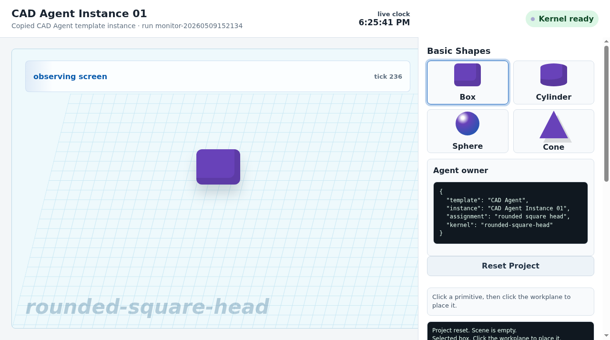 |
| CAD Agent Instance 02 | `circular eyes` | `part-manifest-circular-eyes` | 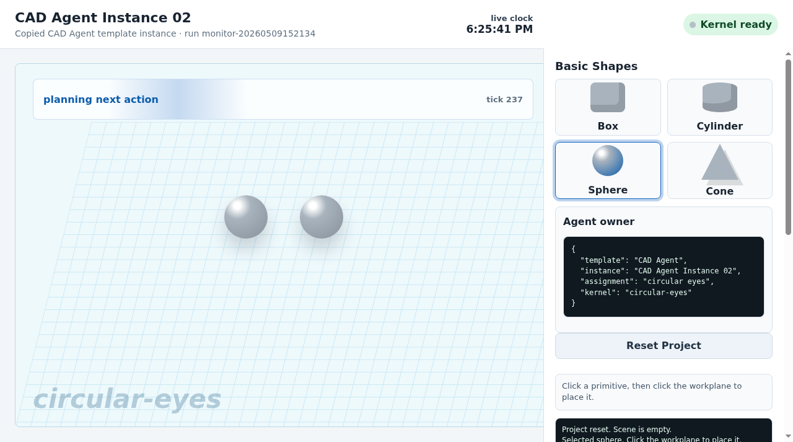 |
| CAD Agent Instance 03 | `eye pupils` | `part-manifest-eye-pupils` | 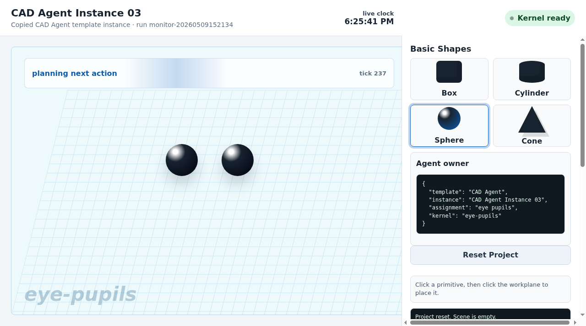 |
| CAD Agent Instance 04 | `smile` | `part-manifest-smile` | 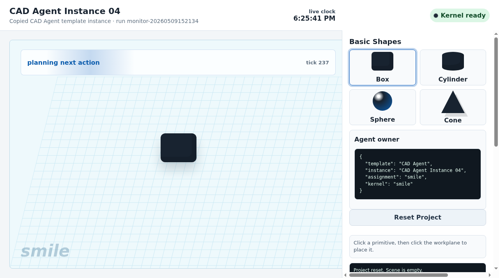 |
| CAD Agent Instance 05 | `rounded body` | `part-manifest-rounded-body` | 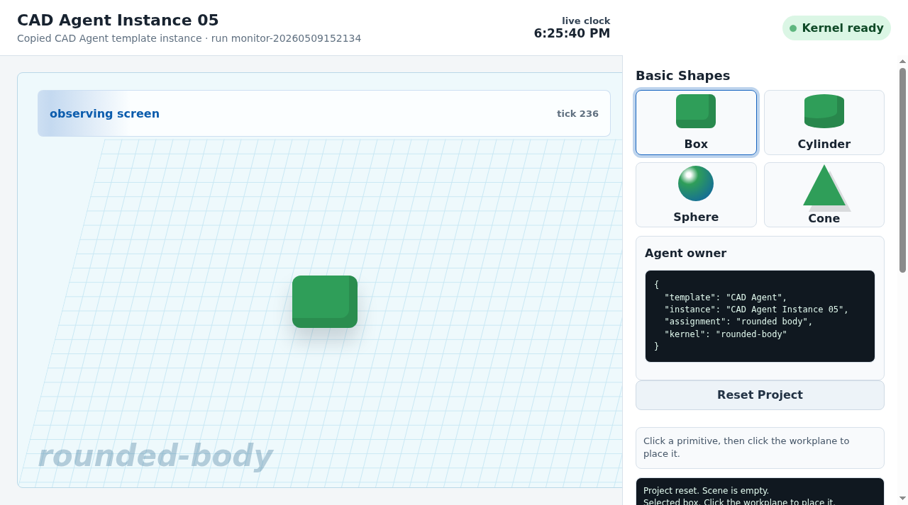 |
| CAD Agent Instance 06 | `chest screen frame` | `part-manifest-chest-screen-frame` | 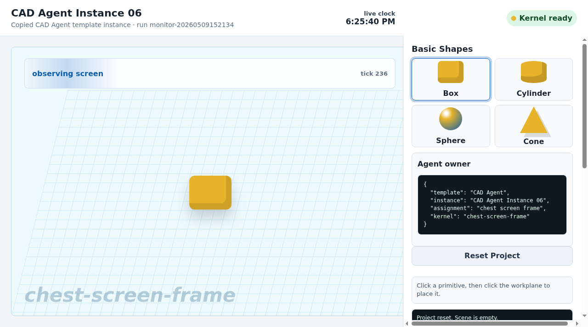 |
| CAD Agent Instance 07 | `inner chest display` | `part-manifest-inner-chest-display` | 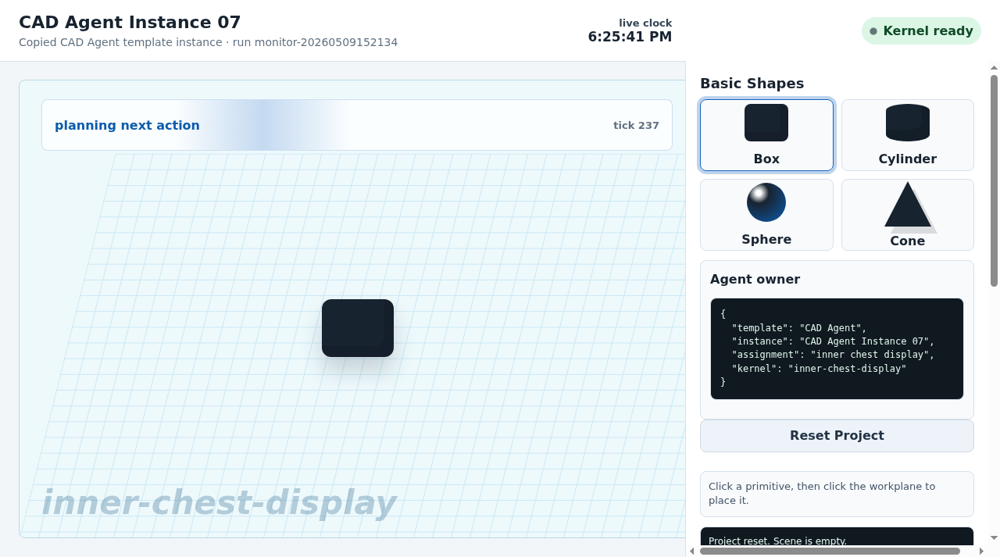 |
| CAD Agent Instance 08 | `segmented cylinder arms` | `part-manifest-segmented-cylinder-arms` | 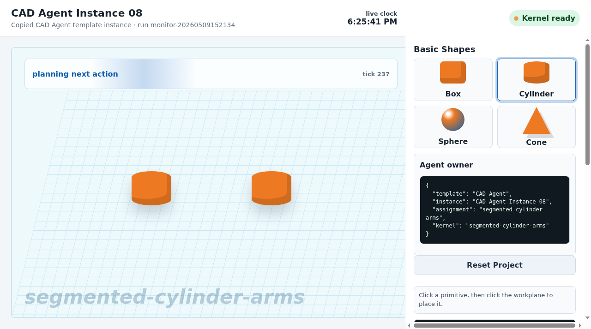 |
| CAD Agent Instance 09 | `claw hands` | `part-manifest-claw-hands` | 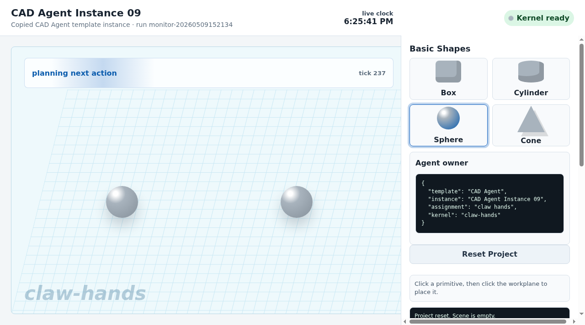 |
| CAD Agent Instance 10 | `wheel feet` | `part-manifest-wheel-feet` | 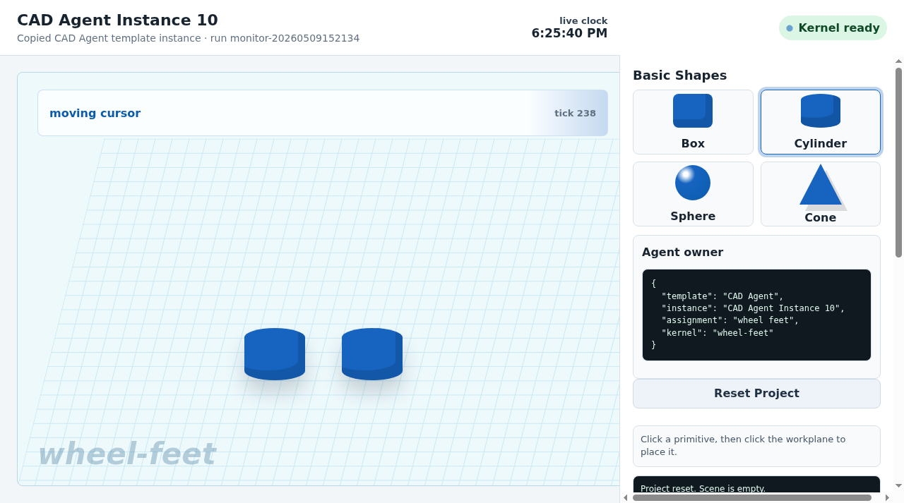 |
| CAD Agent Instance 11 | `wheel hubs` | `part-manifest-wheel-hubs` | 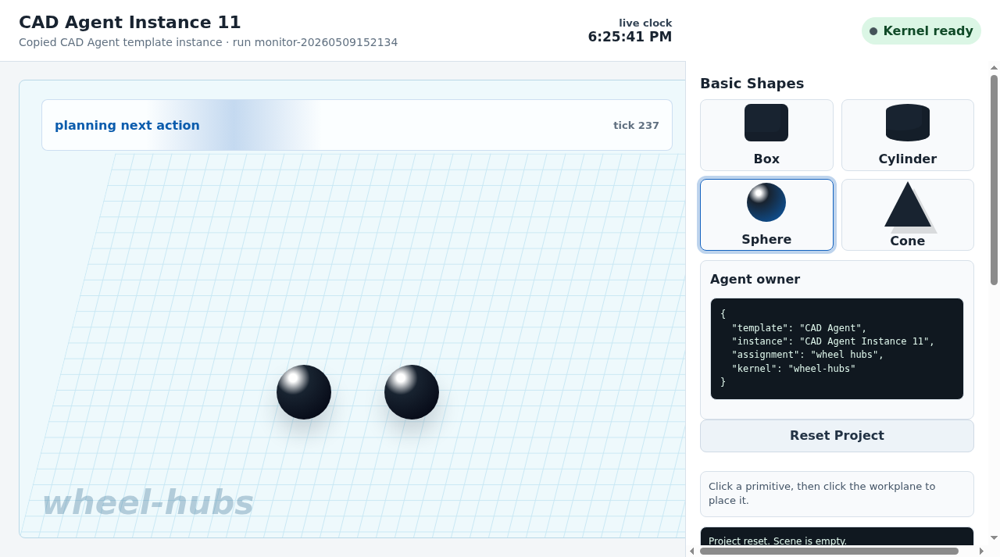 |

The structured run manifest is saved at [`docs/assets/poster-robot-demo/run.json`](docs/assets/poster-robot-demo/run.json).

## Why This Matters

Computer-use agents spend a lot of time waiting on screenshots, page state, clicks, and UI latency. A single agent doing every CAD action serially is slow and brittle.

The Agent Factory pattern turns that into a coordination problem:

- The main agent routes and supervises.
- Specialist agents do the screen work.
- Kernel provides independent computer surfaces.
- Part manifests make the outputs composable.
- The assembly step can reason over structured outputs instead of only pixels.

The CAD Agent is the first specialist vertical. The same platform idea could later support browser automation agents, research agents, spreadsheet agents, design agents, or other computer-use specialists.

## What Works In This MVP

- Interactive local monitor UI at `public/parallel-cad.html`
- Prompt-derived part planning, not a fixed robot-only pipeline
- One Kernel browser per CAD Agent instance, plus one assembly Kernel
- MiniCAD workbench rendered inside each Kernel browser
- Live screenshot polling every few seconds
- Run manifest showing planner output, worker status, screenshots, backend, and exported manifests
- Two execution backends:
  - **Codex backend** for deterministic, reliable demo execution
  - **Northstar / Lightcone backend** for model-computer-use comparison
- Fresh project option so every new run starts from a clean workspace
- Scripted baseline demos for recordings and fallback

## Related Tinkercad Experiment

The repo also includes an earlier Tinkercad-focused computer-use prototype in [`experiments/tinkercad-cua-hackathon/`](experiments/tinkercad-cua-hackathon/). That experiment explores the same pain point from a different angle: helping people move from plain-language 3D ideas and tutorial references into concrete CAD assets without manually replaying every browser step.

## Current Limitations

This is intentionally a hackathon MVP:

- The CAD surface is a MiniCAD demo workbench, not yet Tinkercad or a production CAD editor.
- Exported assets are simplified primitive manifests, not STL/OBJ files yet.
- The Codex backend is deterministic so the demo is reliable.
- Northstar can be selected, but quality and latency depend on the model run.
- The Agent Factory currently demonstrates the CAD Agent vertical; a full marketplace of specialist agents is the next step.

## Architecture

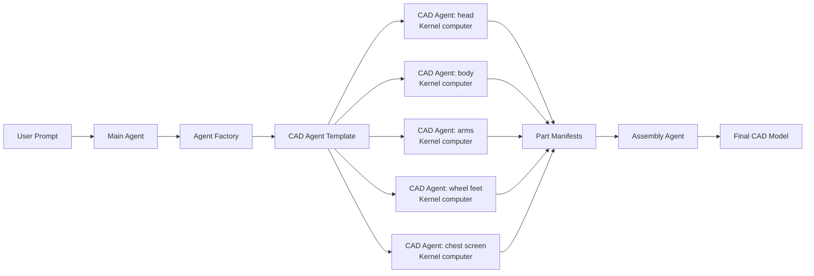

## Run Locally

Prerequisites:

- Node.js 20+
- Kernel CLI installed and authenticated
- A Kernel account with browser access
- Optional: `TZAFON_API_KEY` if you want to run the Northstar backend

Install dependencies:

```bash
npm install
```

Start the interactive Agent Factory monitor:

```bash
npm run serve
```

Open the URL printed by the server. By default it starts at:

```text
http://127.0.0.1:8780/parallel-cad.html
```

If port `8780` is busy, the server automatically tries the next available port and prints the exact URL.

Run with Northstar as the default backend:

```bash
TZAFON_API_KEY=your_key_here npm run serve:northstar
```

You can also select the backend directly in the UI:

- `Codex backend`
- `Northstar`
- `Monitor only`

## Useful Commands

```bash
# Interactive monitor, default reliable backend
npm run serve

# Force Codex backend
npm run serve:codex

# Force Northstar backend
npm run serve:northstar

# Deterministic multi-Kernel script demo
npm run demo -- "Make a cute desktop robot with a purple head, green body, orange arms, blue wheel feet, and a small chest screen."

# Northstar + Kernel script demo
npm run demo:northstar

# Syntax checks
npm run check
```

## Project Structure

```text
public/
  parallel-cad.html        Interactive Agent Factory monitor UI
  parallel-cad.css         UI styling
  parallel-cad.js          Dashboard polling and monitor rendering

scripts/
  monitor-server.mjs       Local API that creates Kernel sessions and agent backend loops
  parallel-cad-kernel-demo.mjs
                            Deterministic Kernel baseline demo
  northstar-parallel-kernel-demo.mjs
                            Scripted Northstar + Kernel demo

demo-results/
  latest/                  Recorded baseline run report
  quality-check/           Screenshots from quality and assembly checks

docs/assets/
  computer-use-cad-platform-poster.png
                            Poster / flowchart for the hackathon pitch
  poster-robot-demo/        Current task prompt, worker screenshots, final assembly screenshot, and run manifest
```

## How To Demo It To Judges

1. Start with the one-sentence pitch: "We are building a computer-use CAD platform where the main agent finds specialist agents and lets them operate CAD computers."
2. Enter a prompt in the monitor UI.
3. Show that the main agent generates part-specific CAD Agent prompts.
4. Show multiple CAD Agent instances running in separate Kernel computers.
5. Point out that the screenshots update independently.
6. Open the Factory Manifest and show exported part manifests.
7. End on the Assembly Agent view where the final model is assembled from worker outputs.

The demo object can be simple. The key idea is the platform pattern: **main agent routes, Agent Factory launches, specialist CAD Agents operate computers, assembly consumes structured outputs.**
